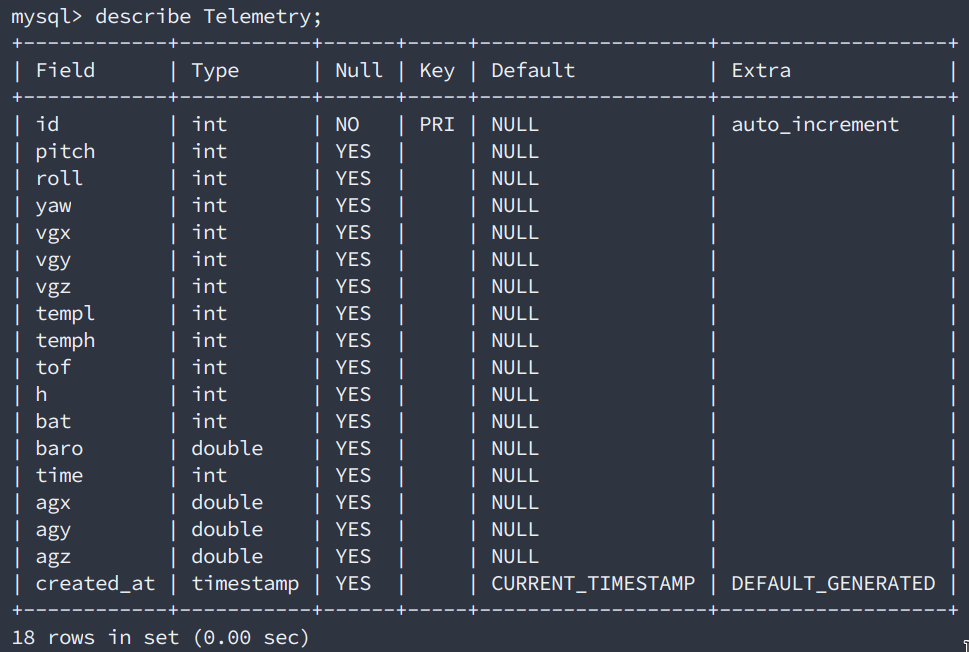
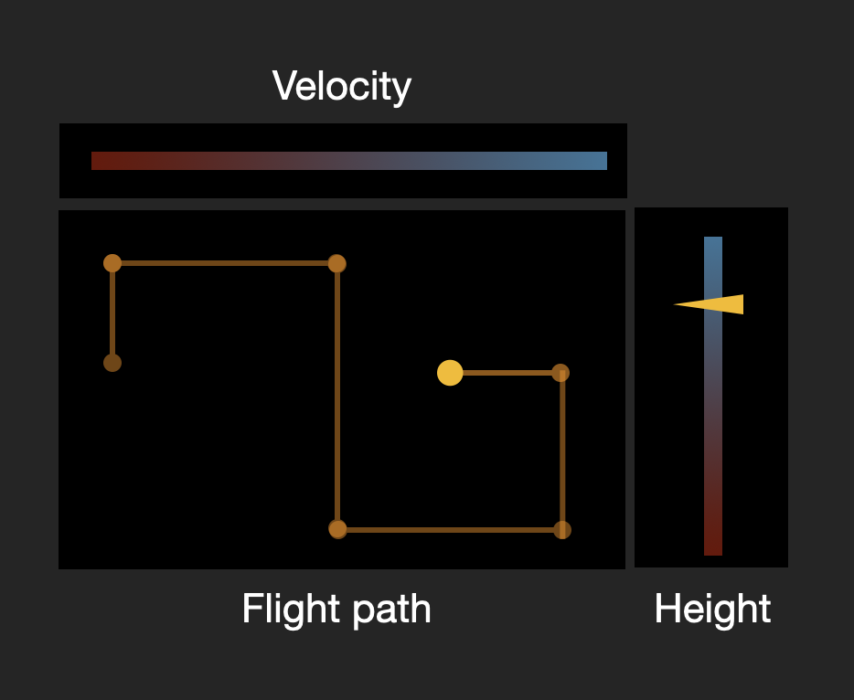

Drone record: https://youtu.be/h82PPONSImI
Screen record: https://youtu.be/eDvkM0t9hD0

# Lab 5 - Drone Controller Pt 2

## Due Date

Friday Feb 19 @ 9 p.m. PST

## Prerequisites

This lab builds on the previous lab. Please make sure to have watched all of these videos. Please refer to the videos if you are stuck on any part of the lab.

1) Video lecture on [HTML](https://www.youtube.com/watch?v=Ht5nE2l4mJI)
2) Video lecture on [Web Serving Fundamentals](https://www.youtube.com/watch?v=5a0R2yiiEeo)
3) Video lecture on [REST](https://www.youtube.com/watch?v=YHZmSlF-rOU)
4) Video lectures on Javascript
    1) [Introduction to Javascript](https://www.youtube.com/watch?v=E0_pEASqB3A&feature=emb_title)
    2) [Interactions](https://www.youtube.com/watch?v=Mwf_qU6zQfo)
    3) [Asynchronous javascript + JSON](https://www.youtube.com/watch?v=eusDs93MlnQ)
5) DB Intro Videos(Pick one of these):
    1) Intro to Database [Video](https://youtu.be/3_GMPJFF1sI)
    2) Advanced Intro to Database [Video](https://youtu.be/GsSagoCByzc)
6) DB Crud Operations [Video](https://youtu.be/FV0hr-cw47A)
7) DB Join Operations [Video](https://youtu.be/-LqlkZ6S7p4)
8) RESTful Databases
    1) [Video 1](https://youtu.be/czJYswiRx-g)
    2) [Video 2](https://youtu.be/U73e3TJxvxM)
9) CSS
    1) [Intro Part 1](https://youtu.be/dSgJWh8vo1M)
    2) [Intro Part 2](https://youtu.be/6mdtAkrMKmw)
    3) [Intermediate Design](https://youtu.be/6D5sg7JdsZg)

## Overview

We will be adding more features to the drone controller that we built in lab 4. By the end of this lab, you will add an additional database table to store and display the drone's state information. You will also improve your web page design.

Here is a quick recap from the previous lab (Lab 4):

You built a web-based controller interface to control your drone that now works with a MySQL databases. We now have three containers:

1. `web-server` (a web server in Python)
2. `drone-controller` (a Python program to talk to our drone API)
3. `mysql-db` (a database server you talk to using MySQL)

**Note, there are a lot of moving parts in this lab! A multitude of bugs may appear depending on your implementation. Please start early to avoid last minute questions as there may not be enough instruction staff to help.**


## Challenge 1 - UI Elements

You are now a certified drone pilot, and in order to show off your skills we want to be able to fly in a predefined flight path (a **Flight Plan**). This can be achieved by sending a "text-based" list (translation... JSON) of instructions to your server from the browser. The server then splits the **Flight Plan** up into individual drone commands and enters them into the MySQL database in the same we did in Lab 4. The `drone_controller` will operate as it did before, by iteratively pulling commands from the DB, and issuing them to the drone in order. In this first challenge, you will be implementing the UI elements to enable the flight plan.

### 1.1 Flying Modes: Interactive flying Mode (like Lab 4) OR **Flight Plan** mode

You will add a new "toggle" button (checkbox, radio button, select element, whatever you like) that determines whether your controller is in "Interactive" or "FlightPlan" mode.  

#### Interactive Mode

In this mode, your UI works the same way as it did in Lab 4. Click a button, a command is sent to the server on the same route you used in Lab 4. The server logs the command into the DB, and it will get dispatched to the drone.

#### FlightPlan Mode

In **FlightPlan** Mode, you will display a **textarea** input control. Your user can enter a series of well-formed commands - one command per line. When the user presses the "Send Flight Plan" button (or a similar name), the commands are all sent to the server on a NEW route called `/flight_plan`. Your server will break each line of the input into an individual command, and insert all the commands into the DB. The commands are dispatched to the drone as usual, in order.

To enable the "FlightPlan" toggle button, you will need to add CSS and Javascript to your page. You'll also need a new route on your webserver to receive **FlightPlan** mode commands.

> NOTE: It's up to you how you want your UI to behave. For example, you could show "flight control buttons" if you are in "Interactive Mode" and show the `textarea` control when you're in **FLightPlan** mode. Whatever you choose, it is important that you think about the user experience. Will users be confused by having the extra controls that may not work in a given mode?

### 1.2 Text Area and Send button

You should create a `textarea` form control that holds your flight plan as well as a send button once the flight plan commands are inputted. The flight plan should be in this format:

```tello
UP 50
CCW 20
DOWN 20
(etc,)
```

It is *totally* up to you how you want to send the commands. But remember, once the commands arrive at the server, it will have to be able to make sense of each line, and insert the command into the DB.

### 1.3 Command Logging View using CSS (no tables)</br>

In this step, you will add a section on the homepage that shows flight telemetry data from the drone. Note - you **MAY NOT** use an HTML table element to display this data. You must use [grids](https://semicolon.dev/tutorial/css/complete-css-grid-tutorial), [flexbox](https://semicolon.dev/tutorial/css/complete-css-flex-tutorial), or other CSS techniques. That means you'll need to write some CSS to get a "grid-like" experience.

Each telemetry record contains the following information that you need to display:

```telloState
agx, agy, agz, baro, bat, h, pitch, roll, temph, templ, time, tof, vgx, vgy, vgz and yaw. 
```

### 1.4 Present telemetry data using Javascript(timer based pull)</br>

Using the "telemetry view" you created in 1.3, now you will pull telemetry data every 3 seconds from the server and append that data to your view. Remember the `/fake_data` from Lab 3? This is exactly the same task but with real data. Do not use HTML `table` tags, but you can use the code from Lab 3 if you would like. Just make sure here that the new route you hit is `/get_telemetry` to grab the JSON data and you should use the fetch() function in `web_ui.js`. Just like Lab 3, a timer update is required, so you will need to append a new data point to the tabular view every 3 seconds.

## Challenge 2 - Flight Plan Route

In this step, we add routes to process multiple drone commands sent as a single string (JSON). You will be parsing this string and calling the `send_command` function for each VALID command. Then, you will be adding a route to retrieve the latest drone state from a **new** MySQL table.

The first step is to build a route to handle the list of drone commands sent when the submit button next to the text area is clicked. You will notice that the route has not been provided to you and you will have to add it yourselves. The format of the route is `/flight_plan/{command_string}`. This is similar to the route to handle singe drone commands: `/drone_command/{command}*arg`.

What's changed here is that multiple commands (both the command and the magnitude of the command (where appropriate)) are part of the command_string argument. Each command in `command_string` - which may be separated commas if you prefer. If the command has a magnitude argument corresponding to it, the argument and the command are separated by an underscore. An example of the `command_string` argument:

```tello
takeoff
cw_90
up_50
down_30
cw_90
land
```

When implementing the functionality for this route, you will need to parse `command_string` to extract each command and then call `send_command()` on each valid command (similar to how the logic for single commands was implemented).

Once you've completed this, you will have a route that can handle multiple drone commands at once.

The next step is to build a route to retrieve te drone state information from the Telemetry table. Here is a schema for the table:

**You will need to add the SQl commands to create this table in `init-db.sql`. Make sure the table name is `Telemetry`!**



The route again has not been provided to you and you will need to add it yourself. Note that the format that the drone state information will be returned is the same as the format in which fake state information was returned in lab 3. In this step, you will have to run SQL commands to retrieve the **latest state information**, convert it to a JSON string and return a Response. Note that you have to add additional logic to handle the case where state information is not yet available.

## Extra Credit - Drone position visualization

Feeling ambitious? Well, we have a challenge for you. Showing our flight plan data in a list is kind of boring. What would be **REALLY** cool is if you can show a flight plan graphically. In javascript, you can!!! If you want to take on this challenge you will add a `canvas` element to your page, which enables 2D drawings. Use the canvas to show the path of your drown. Also, consider adding a vertical height indicator to the UI to indicate the height of the drone at its current location. Here's what that might look like:



Be advised! This challenge will require the use of more advanced Javascript, some 2D drawing skills, and extra math to convert telemetry data to 2D coordinate space.

## Deliverables:
2 Videos and code submission. Due on: Friday Feb 19 @ 9 p.m. PST

1. A screen recording of using flight record mode (Video 1)
    1. Use the button to turn of flight record mode
    2. Record the commands for your flight record mode, while showing the text box being updated
        - There has to be more than 5 moves (not including takeoff and land)
        - The 5 moves can not be consecutive commands. No up_30 then up_45, each command must be different from the one before
    3. Send the steps to the drone
    4. Make sure the log is also being recorded (be sure to show the auto update of the list)
2. A video of the drone during the flight record mode (Video 2)
3. BE SURE to push your code to github

*Please limit videos to 3 minutes and upload it to YouTube*

For the Videos, please create a file called video_link.txt and paste the youtube video URL in there, include that file in your github submission.

Again, please start early.

Once you are finished, push all of your code to Github. Good luck!

